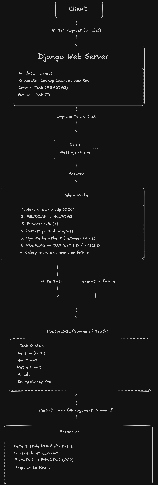

## Problem Statement

Web scraping is an I/O-bound operation that can take several seconds to complete. Processing these requests inside the HTTP request blocks a web worker until the task finishes, reducing throughput and increasing client wait time.

This project explores how to move long-running jobs outside the request lifecycle while keeping task state consistent, recovering from worker failures, and preventing duplicate processing.

---

## Design Evolution

### Version 1 – Synchronous Processing

The server handled scraping inside the request itself. The client had to wait until the scraping completed before receiving a response.

**Problem**

* Long-running requests block web workers.
* Poor user experience.
* Limited throughput.

---

### Version 2 – Background Processing

The server creates a task, returns a Task ID immediately, and a background worker processes the task asynchronously. The client polls the task status using the Task ID.

**Problem**

* If the worker crashes while processing, the task remains in the RUNNING state forever.

---

### Version 3 – Celery + Redis

Celery workers consume tasks from Redis and process them asynchronously. Failed task execution can be retried using Celery's retry mechanism.

**Problem**

* A worker crash after acquiring a task still leaves the task stuck in RUNNING.

---

### Version 4 – Heartbeat, Reconciler and OCC

Workers periodically update a heartbeat while making progress. A reconciler scans for stale RUNNING tasks and requeues them. Optimistic Concurrency Control (OCC) ensures only the current owner of a task can update its state, preventing stale workers from overwriting newer results.

---

## Architecture



## State Machine

```
PENDING
   │
   ▼
RUNNING
   ├──────────────► COMPLETED
   │
   └──────────────► FAILED
```

Only valid state transitions are allowed. Each transition also increments the task version to support optimistic concurrency control.

---

## Failure Scenarios

| Failure                                 | Recovery                                                 |
| --------------------------------------- | -------------------------------------------------------- |
| Worker crashes                          | Reconciler detects stale heartbeat and requeues the task |
| Network exception while worker is alive | Celery retries the task                                  |
| Duplicate client request                | Existing task is returned using the idempotency key      |
| Partial batch failure                   | Successful and failed URLs are returned separately       |
| Database / Redis failure                | Not handled in the current implementation                |

---

## Recovery Strategy

The system uses two recovery mechanisms.

* **Celery Retry** handles execution failures while the worker is still alive (for example, when all URLs fail during processing).
* **Reconciler** periodically scans RUNNING tasks. If a task has not updated its heartbeat within the configured threshold, it is assumed to be abandoned, moved back to PENDING, and queued again for another worker.

---

## Optimistic Concurrency Control (OCC)

Each task stores a version number.

Whenever a worker acquires or updates a task, it verifies that the version in the database still matches the version it originally acquired. If another worker has already reclaimed the task, the version changes and the stale worker's update is rejected.

This prevents multiple workers from successfully updating the same task.

---

## Idempotency

An idempotency key is generated for each task request.

If the same request is received again within the configured time window, the existing task is returned instead of creating a new one. A UNIQUE database constraint guarantees that only one task can be created for a given idempotency key, even if duplicate requests arrive simultaneously.

---

## Trade-offs

* A task processes multiple URLs as a single unit. Failed URLs are not retried individually.
* Heartbeat represents task progress rather than true worker liveness. A long-running URL may temporarily appear as a stale task.
* OCC prevents stale workers from modifying task state but cannot prevent duplicate computation.
* Idempotency is time-window based, so identical requests outside the configured window are treated as new tasks.
